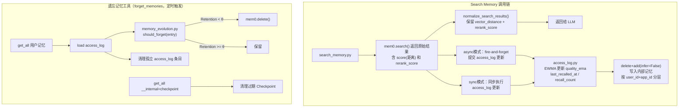

# 记忆演变实现计划（遗忘机制 + Checkpoint 清理）

## 架构概览




## 数据结构

**Access Log 内部记忆**（per user + app，一条 JSON blob）：

- 作用域：`user_id` + `agent_id`（由 `app_id` 映射）
- metadata: `__internal=true`, `internal_type=access_log`, `version=v1`
- content（JSON）：

```json
{
  "mem_id_abc": {
    "last_recalled_at": "2025-03-01T10:00:00Z",
    "recall_count": 3,
    "quality_ema": 0.72
  }
}
```

**遗忘算法关键公式**：

- 质量分：有 `rerank_score` 时直接用（同一 reranker 量纲一致），否则 `max(0, 1 - distance)`
- EWMA 更新（仅 quality >= q_min 时）：`quality_ema = α * quality + (1-α) * old_ema`
- 召回强度：`recall_strength = min(recall_count, N_max) * quality_ema`
- 稳定性：`S = S0 * g ** recall_strength`（天）
- 保留率：`Retention = exp(-age_since_last_recalled / S)`
- 遗忘判断：`Retention < θ` 时删除

**默认参数**（作为 provider credentials 暴露）：

- `q_min = 0.50`：低于此质量的召回不计入强化
- `alpha = 0.30`：EWMA 衰减因子（等效最近 ~3 次）
- `n_max = 6`：最大有效召回次数
- `s0 = 30`（天）：基础稳定性
- `g = 1.8`：稳定性增长因子
- `theta = 0.05`：遗忘阈值（5% 保留率时删除）
- `checkpoint_ttl_days = 90`：Checkpoint 独立 TTL

S_max ≈ 30 × 1.8^(6×1.0) ≈ 1020 天（约 2.8 年）

## 文件清单

### 新增文件（3个）

1. `[utils/access_log.py](utils/access_log.py)` - Access Log 管理器
2. `[utils/memory_evolution.py](utils/memory_evolution.py)` - 遗忘算法与质量分计算
3. `[utils/memory_forgetting.py](utils/memory_forgetting.py)` - 遗忘算法与质量分计算（原 memory_evolution.py）
4. `[tools/forget_memories.py](tools/forget_memories.py)` + `[tools/forget_memories.yaml](tools/forget_memories.yaml)` - 遗忘工具

### 修改文件（3个）

1. `[utils/mem0_client.py](utils/mem0_client.py)` - `normalize_search_results` 保留 `rerank_score` 和 `vector_distance`
2. `[tools/search_memory.py](tools/search_memory.py)` - 搜索后 fire-and-forget 触发 access_log 更新
3. `[utils/constants.py](utils/constants.py)` - 新增 `FORGET_*` 默认参数常量
4. `[provider/mem0ai.yaml](provider/mem0ai.yaml)` - 注册遗忘参数（`forget_*` 前缀，6个）+ 遗忘记忆工具

## 现有缺口修复

`**utils/checkpoint.py**`：`_load_items` 当前仅按 `user_id` 过滤，`app_id` 传入 `load()` 后未被用于查询，导致多 App 用户的 checkpoint 混在一起。修复：`get_all` 调用时传入 `agent_id=app_id`（有 app_id 时），与 `save()` 的写入逻辑对齐。此修复需同步在 `SyncCheckpointManager` 和 `AsyncCheckpointManager` 两个类中完成。

## 关键实现细节

### utils/access_log.py

- 模式完全复用 `[utils/checkpoint.py](utils/checkpoint.py)` 的 `SyncCheckpointManager` / `AsyncCheckpointManager`
- metadata: `internal_type=access_log`，filter 同 checkpoint 逻辑
- `load(user_id, app_id)` → `(log_id, dict[mem_id, entry])`：`get_all` 时同时传入 `user_id` 和 `agent_id=app_id`（有 app_id 时），确保按 App 隔离
- `save(log_id, user_id, app_id, log_dict)` → delete 旧记录 + `add(infer=False, agent_id=app_id)`

### utils/memory_evolution.py

- `get_quality_score(result: dict) -> float`：从单条搜索结果提取质量分（优先 `rerank_score`，否则 `1 - score`）
- `update_entry(entry, quality, params) -> dict`：EWMA 更新，返回新 entry
- `should_forget(entry, now_iso, params) -> bool`：Ebbinghaus 保留率判断

### utils/mem0_client.py

- `normalize_search_results` 扩展，在 dict 中额外保留：
  - `"vector_distance": r.get("score", 1.0)` - 原始向量距离（用于无 reranker 时）
  - `"rerank_score": r.get("rerank_score")` - reranker 分值（None 表示未启用）

### tools/search_memory.py

- 在执行完 search、得到 `results`（normalize 之前）后，提取每条结果的质量分
- **async 模式**：使用 `asyncio.run_coroutine_threadsafe` fire-and-forget 提交 access_log 更新（复用现有 `BackgroundEventLoop`），搜索立即返回不阻塞
- **sync 模式**：搜索完成后直接调用 `SyncAccessLogManager.update()`，3 次纯 IO 操作（无 LLM/embedding），约 25–160ms 额外延迟，逻辑更简单
- 两种模式均从 `payload` 中获取 `user_id` 和 `agent_id`（即 `app_id`）传给 access_log manager
- 从 `self.runtime.credentials` 读取遗忘参数

### tools/forget_memories.py（ForgetMemoriesTool）

- 工具参数：`user_id`（必填），`app_id`（可选，作为 `agent_id` 过滤），`dry_run`（可选，仅返回待删除列表不实际删除）
- 流程：
  1. `get_all(user_id, agent_id=app_id)` 获取用户所有记忆（后过滤 `__internal`）
  2. `access_log.load(user_id, app_id)` 获取 access log（按 user_id + app_id 作用域）
  3. 对每条记忆调用 `should_forget()`，收集待删除列表
  4. 批量 `mem0.delete()`，更新 access_log（清理已删除 mem_id 的条目）
  5. 额外：`get_all` 过滤 `internal_type=checkpoint` + `agent_id=app_id`，按 `updated_at` 保留最新 1 条，删除其余；若最新一条也超过 `checkpoint_ttl_days`（默认为 90 天）则一并清理
- 返回：`{"deleted_count": N, "retained_count": M, "checkpoints_cleaned": K}`

