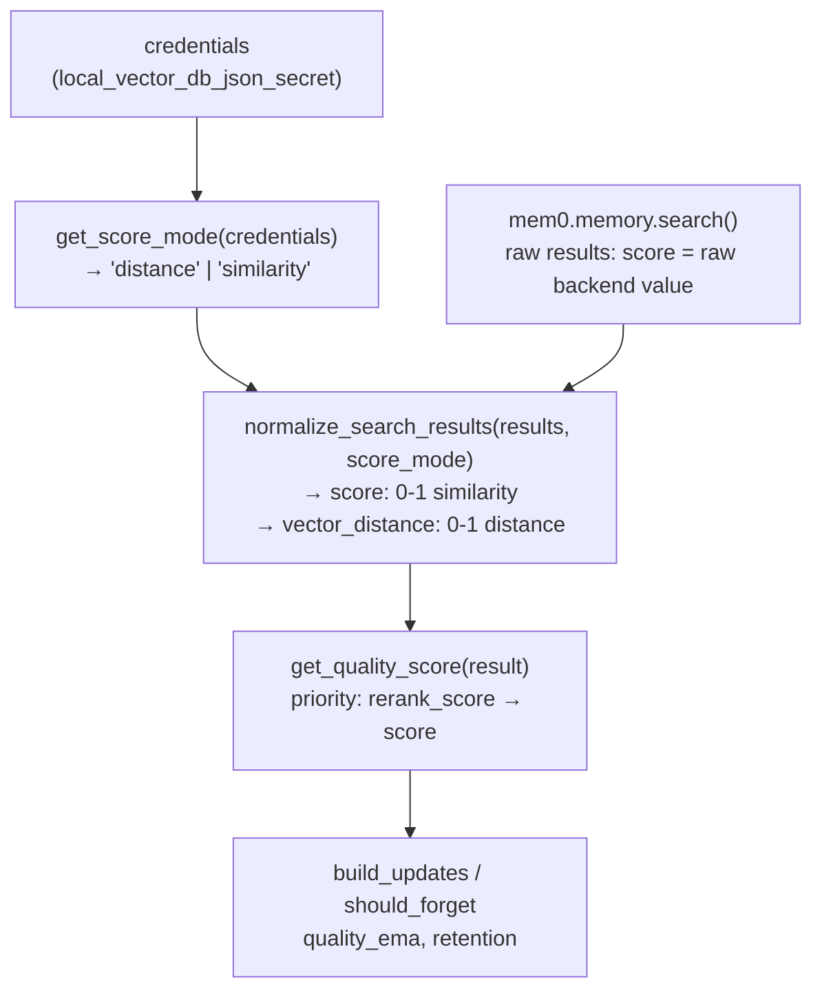

# Score Mode 适配方案

## 核心问题

当前 `normalize_search_results` 无条件执行 `score = 1 - raw_score`，只适合 pgvector 这类"distance 越小越相似"的后端。对于 Elasticsearch/Azure AI Search/Qdrant 等"score 越大越相关"的后端，转换结果会相反。

## 各向量库 score 语义总结（来自 mem0 源码）

**Distance 型**（raw score 是距离，越小越相似 → 需要 `1 - score`）：

- `pgvector`：`vector <=> %s::vector AS distance`，余弦距离
- `azure_mysql`：同 pgvector
- `milvus` with `metric_type = "L2"`（config 中默认值为 `"L2"`）
- `faiss` with `distance_strategy = "euclidean"`（FAISS 中默认值）

**Similarity 型**（raw score 是相关性分，越大越相关 → 直接 clamp 到 [0,1]）：

- `elasticsearch`：`hit["_score"]`
- `azure_ai_search`：`result["@search.score"]`
- `qdrant`：Qdrant SDK 所有 metric 均返回 higher=better
- `milvus` with `metric_type = "COSINE"` 或 `"IP"`
- `faiss` with `distance_strategy = "inner_product"` 或 `"cosine"`
- 其余所有后端（chroma, pinecone, weaviate, mongodb, redis, opensearch, supabase 等）

**Reranker（优先级最高）**：所有 5 种 reranker 均输出 0–1 的 `rerank_score`，降序排列，直接 clamp 使用。

## 数据流




## 改动文件清单

### 1. 新建 `[utils/score_utils.py](utils/score_utils.py)`

新增 `get_score_mode(credentials) -> Literal["distance", "similarity"]`：

```python
def get_score_mode(credentials: dict) -> str:
    raw = credentials.get("local_vector_db_json_secret") or credentials.get("local_vector_db_json")
    # parse provider and config from raw JSON block
    provider = ...
    config   = ...

    if provider in ("pgvector", "azure_mysql"):
        return "distance"

    if provider == "milvus":
        metric = str(config.get("metric_type", "L2")).upper()
        return "distance" if metric == "L2" else "similarity"

    if provider == "faiss":
        strategy = str(config.get("distance_strategy", "euclidean")).lower()
        return "distance" if strategy == "euclidean" else "similarity"

    return "similarity"  # qdrant, elasticsearch, azure_ai_search, chroma, pinecone, etc.
```

> 解析 JSON block 直接重用 `config_builder._parse_json_block` 的逻辑，但不引入内部函数；只做一次轻量解析，无缓存（调用方缓存在实例上）。

### 2. 修改 `[utils/mem0_client.py](utils/mem0_client.py)`

`**normalize_search_results` 签名和逻辑**（第 78–131 行）：

```python
def normalize_search_results(
    results: object,
    score_mode: str = "distance",   # 新增参数
) -> list[dict[str, Any]]:
    ...
    for r in items or []:
        raw_score   = float(r.get("score") or r.get("similarity", 0.0))
        rerank_score = r.get("rerank_score")

        if rerank_score is not None:
            # reranker: 0-1 similarity, highest priority
            score           = max(0.0, min(1.0, float(rerank_score)))
            vector_distance = max(0.0, 1.0 - score)   # synthetic
        elif score_mode == "distance":
            # pgvector / milvus-L2 / faiss-euclidean
            vector_distance = float(raw_score)
            score           = max(0.0, 1.0 - vector_distance)
        else:
            # elasticsearch / azure_ai_search / qdrant / etc.
            score           = max(0.0, min(1.0, float(raw_score)))
            vector_distance = max(0.0, 1.0 - score)   # synthetic distance

        normalized.append({ ..., "score": score, "vector_distance": vector_distance, ... })
```

`**SyncMem0Client.__init__**`（第 199 行附近）：

```python
from .score_utils import get_score_mode
...
self.score_mode = get_score_mode(credentials)
```

`**SyncMem0Client.search**`（第 362 行）：

```python
normalized = normalize_search_results(results, score_mode=self.score_mode)
```

`**AsyncMem0Client.__init__**`（第 622 行附近）：

```python
self.score_mode = get_score_mode(credentials)
```

`**AsyncMem0Client.search**`（第 893 行）：

```python
return normalize_search_results(results, score_mode=self.score_mode)
```

> 注意：`config_override` 模式下无 credentials，此时 `get_score_mode({})` 找不到 vector_store config，fallback 返回 `"distance"`（兜底行为与现在一致）。

### 3. 修改 `[utils/memory_forgetting.py](utils/memory_forgetting.py)`

`**get_quality_score**`（第 73–94 行）：

由于 `normalize_search_results` 现在保证 `score` 字段已是 0–1 的相似度，直接使用它作为 fallback，移除对 `vector_distance` 的二次计算：

```python
def get_quality_score(result: dict[str, Any]) -> float:
    rerank_score = result.get("rerank_score")
    if rerank_score is not None:
        return max(0.0, min(1.0, float(rerank_score)))

    # score is always 0-1 similarity after normalize_search_results
    score = result.get("score")
    if score is not None:
        return max(0.0, min(1.0, float(score)))

    # backward-compat: result not processed by normalize_search_results
    distance = result.get("vector_distance", 1.0)
    return max(0.0, 1.0 - float(distance))
```

同步更新函数 docstring 中对 `2. 1 - vector_distance` 的说明改为 `2. score（已由 normalize_search_results 归一化为 0–1 相似度）`。

## 不需要改动的文件

- `utils/config_builder.py`：不改，`score_utils.py` 独立解析，不复用内部函数
- `tools/search_memory.py`：不改，它调用 `client.search()` 拿到的已是归一化结果
- `utils/access_log.py`：不改
- `provider/mem0ai.yaml`：不改（score_mode 是运行时内部推断，不作为用户配置项）

